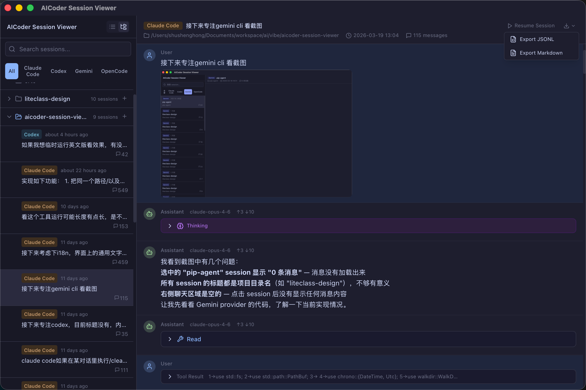

# AICoder Session Viewer

A unified desktop application for browsing conversation histories from multiple AI coding assistants — **Claude Code**, **Codex**, **Gemini CLI**, and **OpenCode** — all in one place.

[中文文档](./README_CN.md)



## Why

AI coding assistants store their session data in different formats (JSONL, JSON, SQLite) scattered across various directories. There's no unified way to browse, search, or compare these conversations. AICoder Session Viewer solves this by normalizing all sources into a single, consistent interface.

## Install

Download the latest release from the [Releases](https://github.com/seastart/aicoder-session-viewer/releases) page.

### macOS

The app is not signed with an Apple Developer certificate. macOS Gatekeeper may block it with an "app is damaged" warning. To fix this, run:

```bash
xattr -cr /Applications/AICoder\ Session\ Viewer.app
```

### Windows / Linux

Download the `.exe` / `.msi` (Windows) or `.deb` / `.AppImage` (Linux) from the release page and install normally.

## Features

- **Multi-tool support** — Claude Code, Codex, Gemini CLI, OpenCode
- **Unified data model** — All session formats normalized on the Rust side before reaching the frontend
- **Rich content rendering** — Markdown, syntax-highlighted code blocks (via Shiki), collapsible tool calls/thinking blocks, and image attachments with click-to-zoom preview
- **Search & navigation** — Filter sessions by tool type, realtime title/path search (300ms debounce) that auto-upgrades to full-text content search (message text, thinking, and tool-call params) 1s after typing stops — or immediately on Enter, and search within the current conversation
- **Project grouping** — Group sessions by project path in a collapsible folder tree; toggle between flat list and grouped view
- **Token usage summary** — Show per-message and session-level token usage when the source data contains usage metadata
- **Subagent drill-down** — Expand Claude Code `Agent` tool calls and lazy-load their subagent conversation
- **Resume, new session & scheduled continue** — Resume any historical session, start a new session from a project folder, or wait until the reset time and then resume with `continue`
- **YOLO launch mode** — Hold Option/Alt or use the context menu to resume/start supported tools with their unattended approval flags
- **Export** — Export sessions as JSONL or Markdown via save dialog
- **Lightweight i18n** — Automatically follows the system/browser language, with `VITE_LOCALE=zh|en` override support
- **Dark theme** — Purpose-built dark UI with per-tool color coding
- **Fast & lightweight** — Native Tauri app with minimal resource usage; SQLite accessed read-only

## Data Sources

| Tool | macOS / Linux | Windows | Format |
|------|--------------|---------|--------|
| Claude Code | `~/.claude/projects/{path}/{uuid}.jsonl` | `%USERPROFILE%\.claude\projects\...` | JSONL (index in `~/.claude/sessions/*.json`) |
| Codex | `~/.codex/sessions/{Y}/{M}/{D}/rollout-*.jsonl` | `%USERPROFILE%\.codex\sessions\...` | JSONL |
| Gemini CLI | `~/.gemini/tmp/{project}/chats/session-*.json` | `%USERPROFILE%\.gemini\tmp\...` | JSON |
| OpenCode | `~/.local/share/opencode/opencode.db` | `%USERPROFILE%\.local\share\opencode\opencode.db` | SQLite |

> All four tools use the user home directory (`~` / `%USERPROFILE%`) as root, with identical directory structures across platforms.

## Custom Data Source Paths

If your tool stores data in a non-default location (e.g., a derivative of OpenCode with a different database path), you can override the path per provider via the in-app **Settings** dialog (gear icon in the sidebar header).

- Click the gear icon in the title bar
- Enter or browse to a custom path for any provider; leave a field empty to use the default
- Click **Save** — changes take effect immediately, no app restart required
- If a custom path is invalid, that provider is silently skipped and a warning is shown

The configuration is persisted at:

- macOS: `~/Library/Application Support/aicoder-session-viewer/config.json`
- Linux: `~/.config/aicoder-session-viewer/config.json`
- Windows: `%APPDATA%\aicoder-session-viewer\config.json`

## Scheduled Continue Strategy

When Claude Code, Codex, Gemini CLI, or OpenCode shows a quota message such as `You've hit your limit · resets 1am (Asia/Shanghai)` or `try again at 1:35 PM`, support scheduled continue strategy:

1. Infer the reset time from the most recent session messages. The parser currently recognizes phrasings such as `resets ...`, `try again at ...`, and `available again at ...`. If no explicit reset time is found, it falls back to the next local `01:00`.
2. Add a fixed 5-minute safety buffer on top of the inferred reset time, so the app does not fire exactly at the boundary.
3. Open a fresh terminal window or tab.
4. Wait until the target time.
5. Run a native `resume + prompt` command that restores the session and sends `continue`.
6. When the target CLI supports unattended execution flags, append them as well so the resumed run does not stall on approval prompts.

Current command shapes for scheduled continue:

- Claude Code: `claude --permission-mode bypassPermissions --resume <session-id> "continue"`
- Codex: `codex resume --dangerously-bypass-approvals-and-sandbox <session-id> "continue"`
- Gemini CLI: `gemini --approval-mode yolo --resume <session-id> "continue"`
- OpenCode: `opencode --session <session-id> --prompt "continue"`

This keeps the behavior aligned with each vendor CLI's supported session model instead of depending on terminal input injection hacks. Where supported, the app also opts into unattended approval modes so the resumed run can proceed without stopping for confirmation.

## Keyboard Shortcuts

| Shortcut | Scope | Action |
|----------|-------|--------|
| `Cmd+F` / `Ctrl+F` | Session detail | Focus the current conversation search box |
| `Enter` | Conversation search box | Jump to the next match |
| `Shift+Enter` | Conversation search box | Jump to the previous match |
| `Esc` | Image preview | Close the full-size image preview |
| Hold `Option` / `Alt` + click resume | Session detail | Resume with YOLO / unattended approval flags when supported |
| Hold `Option` / `Alt` + click new session | Project tree | Start a new session with YOLO / unattended approval flags when supported |

OpenCode currently ignores YOLO mode because its CLI does not expose an unattended approval flag yet.

## Tech Stack

| Layer | Technology |
|-------|-----------|
| Desktop framework | [Tauri v2](https://tauri.app/) |
| Backend | Rust (serde, chrono, rusqlite, walkdir, thiserror) |
| Frontend | React 19 + TypeScript |
| Styling | Tailwind CSS v4 |
| State management | Zustand |
| Code highlighting | Shiki |
| Markdown | react-markdown + remark-gfm |

## Prerequisites

- [Node.js](https://nodejs.org/) >= 20
- [pnpm](https://pnpm.io/) >= 10
- [Rust](https://www.rust-lang.org/tools/install) >= 1.85
- Tauri v2 system dependencies — see [Tauri prerequisites](https://v2.tauri.app/start/prerequisites/)

## Getting Started

```bash
# Clone the repository
git clone https://github.com/user/aicoder-session-viewer.git
cd aicoder-session-viewer

# Install frontend dependencies
pnpm install

# Start in development mode (compiles Rust + starts Vite dev server)
pnpm tauri dev

# Force Chinese or English UI during development
VITE_LOCALE=zh pnpm tauri dev
VITE_LOCALE=en pnpm tauri dev

# Build for production
pnpm tauri build
```

## Project Structure

```
aicoder-session-viewer/
├── src-tauri/                  # Rust backend
│   └── src/
│       ├── main.rs             # Entry point
│       ├── lib.rs              # Tauri app setup & plugin registration
│       ├── error.rs            # Unified error types (thiserror)
│       ├── models.rs           # Shared data models (SessionSummary, Message, ContentBlock...)
│       ├── commands.rs         # Tauri IPC commands
│       ├── export.rs           # Session export (JSONL / Markdown)
│       └── providers/          # Data source implementations
│           ├── mod.rs          # SessionProvider trait + ProviderRegistry
│           ├── claude.rs       # Claude Code (JSONL)
│           ├── codex.rs        # Codex (JSONL)
│           ├── gemini.rs       # Gemini CLI (JSON)
│           └── opencode.rs     # OpenCode (SQLite)
├── src/                        # React frontend
│   ├── App.tsx                 # Root component
│   ├── App.css                 # Tailwind imports + theme variables
│   ├── types.ts                # TypeScript types (mirrors models.rs)
│   ├── i18n/                   # Lightweight Chinese / English locale layer
│   ├── stores/
│   │   └── sessionStore.ts     # Zustand store
│   ├── hooks/
│   │   ├── useAltKeyPressed.ts # Detect Option/Alt for YOLO launch shortcuts
│   │   └── useDebounce.ts
│   ├── utils/
│   │   ├── buildProjectTree.ts # Group sessions into folder tree
│   │   ├── format.ts           # Shared number/time formatting helpers
│   │   └── sessionSearch.ts    # In-session search and shortcut matching
│   └── components/
│       ├── Layout.tsx           # Two-column layout + view mode toggle + settings dialog
│       ├── SettingsDialog.tsx   # Provider path override dialog
│       ├── common/
│       │   └── YoloHint.tsx     # Shared YOLO mode badge
│       ├── Sidebar/
│       │   ├── SearchBar.tsx    # Debounced search input
│       │   ├── ToolFilter.tsx   # Tool type filter tabs
│       │   ├── SessionList.tsx  # Flat session list
│       │   └── ProjectTree.tsx  # Grouped project folder tree + new session launcher
│       └── Chat/
│           ├── ChatView.tsx     # Session detail + search + resume + export buttons
│           ├── MessageBubble.tsx # Message rendering (all content block types)
│           ├── CodeBlock.tsx    # Shiki syntax highlighting
│           └── ToolCallBlock.tsx # Collapsible tool use/result blocks + subagent drill-down
├── index.html
├── package.json
├── vite.config.ts
└── tsconfig.json
```

## Architecture

```
┌─────────────────────────────────────────────────────────┐
│  Frontend (React + TypeScript)                          │
│  ┌──────────────┐  ┌────────────────────────────────┐   │
│  │   Sidebar     │  │   ChatView                     │   │
│  │  - Search     │  │   - Message bubbles            │   │
│  │  - Filter     │  │   - Markdown / Code / Tools    │   │
│  │  - List       │  │   - Thinking blocks            │   │
│  └──────┬───────┘  └───────────────┬────────────────┘   │
│         │  Zustand                  │                    │
│         └──────────┬────────────────┘                    │
│                    │ invoke()                            │
├────────────────────┼────────────────────────────────────┤
│  Tauri IPC         │                                    │
├────────────────────┼────────────────────────────────────┤
│  Backend (Rust)    ▼                                    │
│  ┌─────────────────────────┐                            │
│  │    ProviderRegistry      │                            │
│  │  ┌───────┐ ┌───────┐   │                            │
│  │  │Claude │ │ Codex │   │   → SessionSummary         │
│  │  └───────┘ └───────┘   │   → Session                │
│  │  ┌───────┐ ┌────────┐  │   → Message                │
│  │  │Gemini │ │OpenCode│  │   → ContentBlock           │
│  │  └───────┘ └────────┘  │                            │
│  └─────────────────────────┘                            │
└─────────────────────────────────────────────────────────┘
```

All four data sources implement the `SessionProvider` trait and are normalized into a unified model before being sent to the frontend. If a provider is unavailable (e.g., directory doesn't exist), it is silently skipped without affecting others.

## License

MIT
